## 第二章
### 无ε产生式的上下文无关文法要满足条件
1. 若P中含S → ε ，则S不出现在任何产生式右部，其中S为文法的开始符号；
2. P中不再含有其它任何ε产生式

### 将有ε产生式的上下文无关文法转化为无ε产生式的上下文无关文法
- 算法：
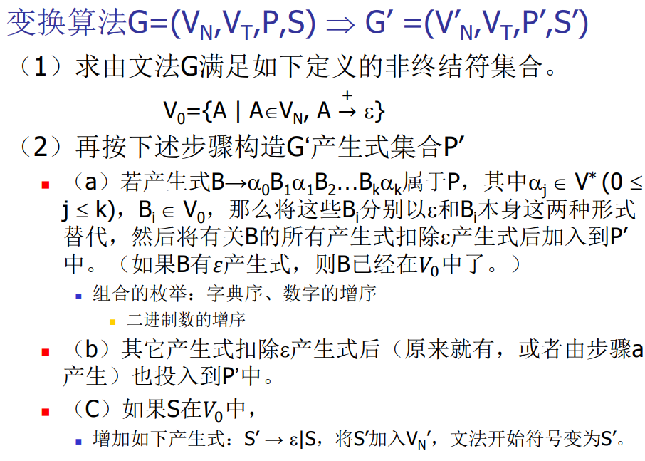

- 示例：
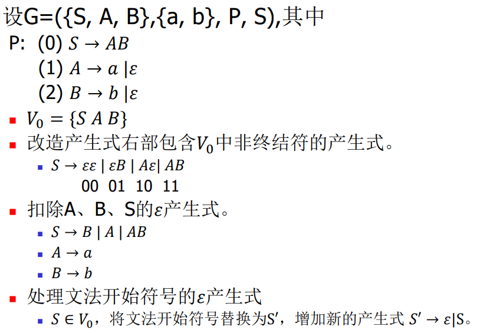

### construct context-free grammars with ε-free production 
1. 画状态转换图
2. 得到产生式

### 参考
[编译原理 东南大学 廖力 08](https://www.bilibili.com/video/BV1cW411B7DW/?p=8)

---

## 第三章
### DFA (Deterministic Finite Automata)
- 定义 
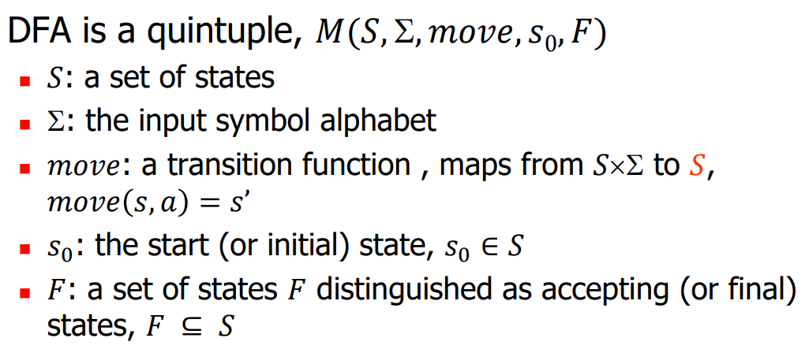
- 特点：
  - no state has an 𝜖-transition(没有𝜖边)
  - for each state 𝑠 and input symbol 𝑎, there is at most one edge labeled 𝑎 leaving 𝑠(每个字符最多一条出边)

### Regular Expression → NFA
Thompson’s Construction Rules
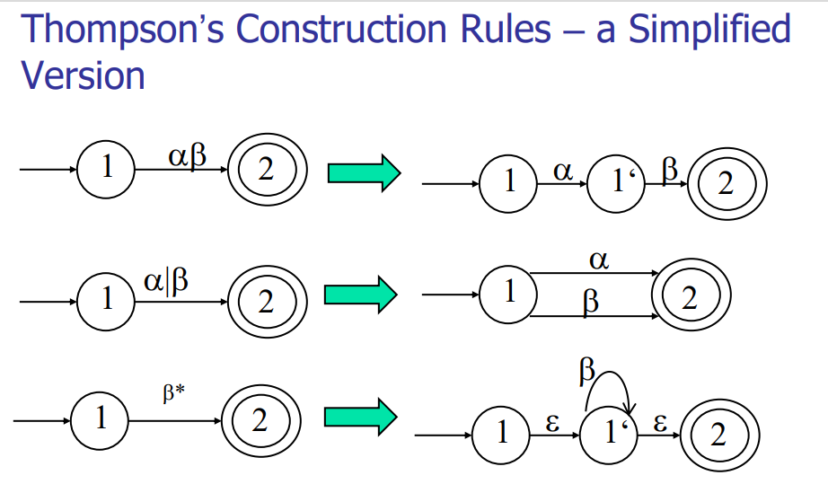

### NFA -> DFA (P153)
- 算法：**"分身"**

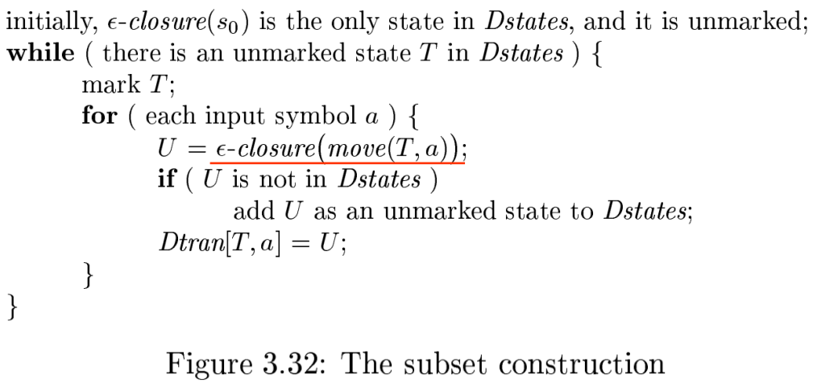

- 示例：
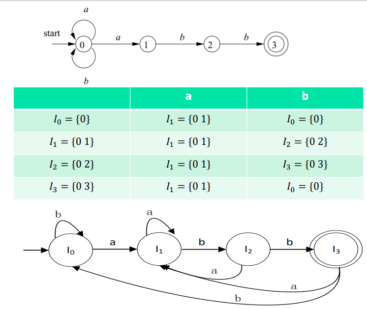

### Minimizing the Number of States of a DFA
1. Construct an initial partition ∏ of the set of states with two groups: the accepting states F and the non-accepting states 𝑆 − 𝐹. Π＝{𝐼0<sup>1</sup>,𝐼0<sup>2</sup>}（初始化）
2. For each group 𝐼 of Π<sub>𝑖</sub>, partition 𝐼 into subgroups such that two states 𝑠 and 𝑡 of 𝐼 are in the same subgroup if and only if for all input symbols 𝑎, 𝑚𝑜𝑣𝑒(𝑠, 𝑎) and 𝑚𝑜𝑣𝑒(𝑡, 𝑎) are in the same group of Π<sub>𝑖</sub>; replace 𝐼 in Π<sub>𝑖+1</sub> by the set of subgroups formed. （在所有输入符号上变迁都一样的放在一起）
3. If  Π<sub>𝑖+1</sub> = Π<sub>𝑖</sub>, let Π<sub>final</sub> = Π<sub>𝑖+1</sub> and continue with step (4). Otherwise, repeat step (2) with Π𝑖+1.（最后一个大步骤是白干的）
4. Choose one state in each group of the partition Π𝑓𝑖𝑛𝑎𝑙 as the representative for that group. The representatives will be the states of the reduced DFA 𝑀’. Let 𝑠 and 𝑡 be representative states for 𝑠’s and 𝑡’s group respectively, and suppose on input 𝑎 there is a transition of 𝑀 from 𝑠 to 𝑡. Then 𝑀’ has a transition from 𝑠 to 𝑡 on 𝑎.（每个group一个结点）
5. If 𝑀’ has a dead state (a state that is not accepting and that has transitions to itself on all input symbols), then remove it. Also remove any states not reachable from the start state. （删除死状态和不可达状态）

---

## 第四章 
### Elimination of Left Recursion
1. Elimination of Immediate Left Recursion（消立即左递归）
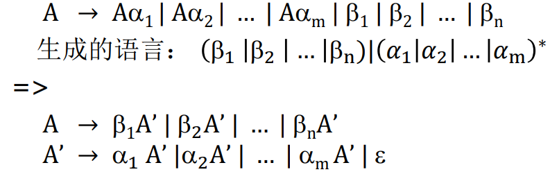

2. Elimination of Indirect Left Recursion （消间接左递归）
   - 算法：
   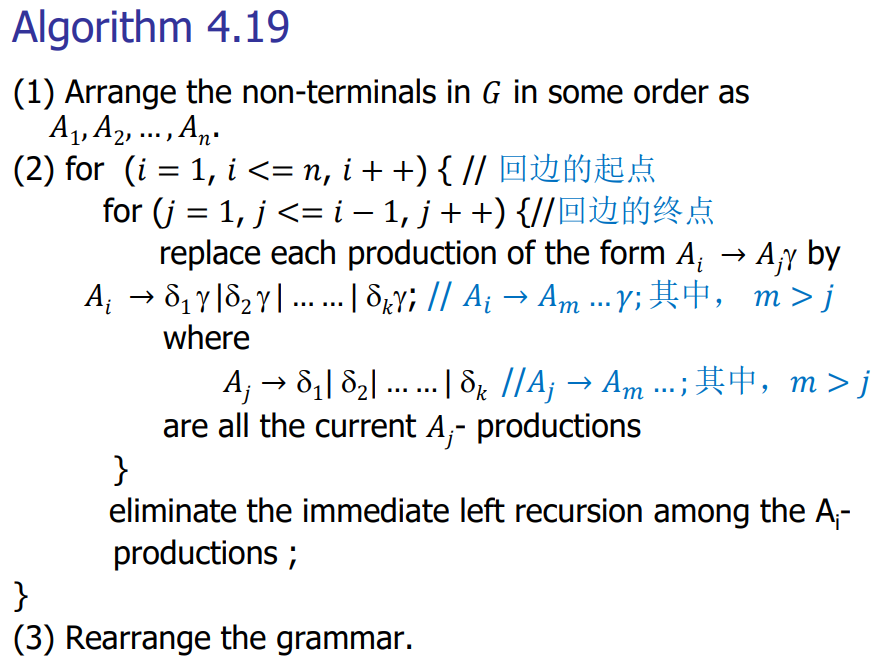
   - 示例：
   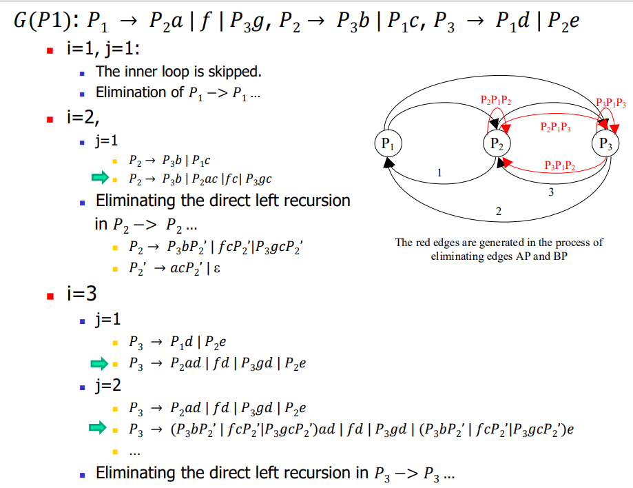

### Extract maximum common left factors
Change productions like 
𝐴 → 𝛿𝛽<sub>1</sub>|𝛿𝛽<sub>2</sub>| …|𝛿𝛽<sub>n</sub>| 𝑟
into
𝐴 → 𝛿𝐴′ | 𝑟
𝐴′ → 𝛽<sub>1</sub>| 𝛽<sub>2</sub>| … | 𝛽<sub>n</sub>
Where, 𝛿 is the longest prefix of the alternatives of A

### 求FIRST
#### FIRST 
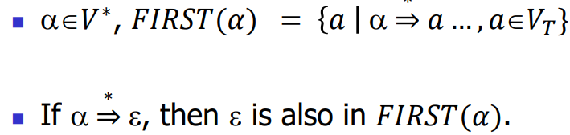

#### 𝐸𝑣𝑎𝑙_𝐹𝐼𝑅𝑆𝑇(𝑌<sub>1</sub>𝑌<sub>2</sub> … 𝑌<sub>k</sub>)
- If 𝑋 is terminal, then 𝐹𝐼𝑅𝑆𝑇(𝑋) = {𝑋}.
- If 𝑋 is a nonterminal and 𝑋 → 𝑌<sub>1</sub>𝑌<sub>2</sub> … 𝑌<sub>k</sub> is a production for some 𝑘 ≥ 1, then place 𝑎 in 𝐹𝐼𝑅𝑆𝑇(𝑋) if for some 𝑖, 𝑎 is in 𝐹𝐼𝑅𝑆𝑇(𝑌<sub>i</sub>), and 𝜀 is in all of 𝐹𝐼𝑅𝑆𝑇 𝑌<sub>1</sub> , … , 𝐹𝐼𝑅𝑆𝑇 𝑌<sub>i-1</sub> ; that is, Y<sub>1</sub> … 𝑌<sub>i-1</sub> ⇒ 𝜀 . （前面的兄弟都躲了，我变成了排头兵）
- If 𝜀 is in 𝐹𝐼𝑅𝑆𝑇 𝑌<sub>j</sub> for all 𝑗 = 1, 2, … , 𝑘, then add 𝜀 to 𝐹𝐼𝑅𝑆𝑇(𝑋). （全班都当了逃兵）
- If 𝑋 → 𝜀 is a production, then add 𝜀 to 𝐹𝐼𝑅𝑆𝑇(𝑋).
- 注：𝐹𝐼𝑅𝑆𝑇(𝑋) is a data structure that represents a set while indexed by 𝑋. (𝐹𝐼𝑅𝑆𝑇(𝑋)是一个表示集合的数据结构，不是函数调用，X是下标不是函数的参数。)
- 注：𝐹𝐼𝑅𝑆𝑇(𝑋) is not a function in the sense of programming language, which can not be taken as a left value, but in the sense of mathematics

#### The Fixed-point Algorithm for Evaluation of First
```
{
for all nonterminal 𝑋 do
𝐹𝐼𝑅𝑆𝑇(𝑋) = Φ;
do
for all production 𝑋 → 𝛼; 
𝐹𝐼𝑅𝑆𝑇(𝑋) → 𝐹𝐼𝑅𝑆𝑇(𝑋) ∪ 𝐸𝑣𝑎𝑙_𝐹𝐼𝑅𝑆𝑇(𝛼) ;
until (∀𝑋 ∈ 𝑉_𝑁, 𝐹𝐼𝑅𝑆𝑇(𝑋) unchanged);
}
```

### 求FOLLOW
#### 要点
1. Place $ in 𝐹𝑂𝐿𝐿𝑂𝑊(𝑆), where 𝑆 is the start symbol and $ is the input right end-marker.
2. If there is 𝐴 → αB𝛽 in 𝐺, then add (𝐹𝐼𝑅𝑆𝑇(𝛽) −{𝜀}) to 𝐹𝑂𝐿𝐿𝑂𝑊(𝐵). (看有弟弟妹妹的非终结符)
3. If there is A →αB, or A→αB𝛽 where FIRST(𝛽) contains 𝜀，then add FOLLOW(A) to FOLLOW(B). (看住在最右边上的非终结符)
4. If there is A→αB𝛽 where FIRST(𝛽) contains 𝜀，then add FOLLOW(A) to FOLLOW(B). (看不住在最右边，但实际可能暴露在最右边的非终结符)

#### 示例
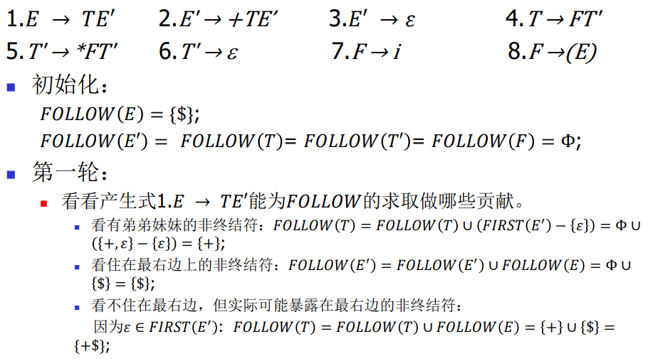
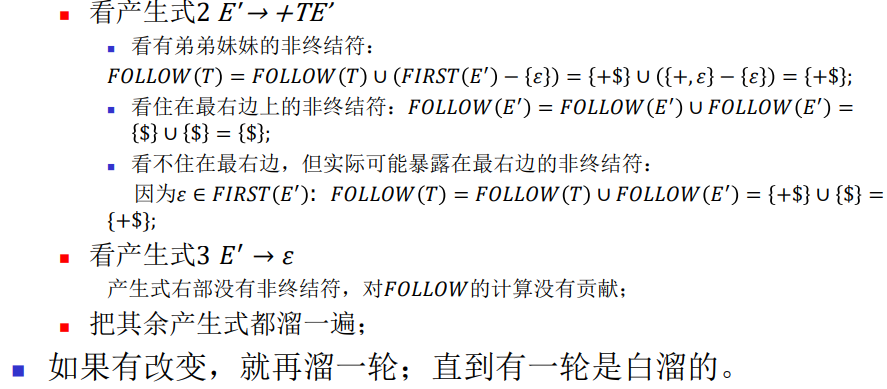

### 求Predictive Parsing Table 
- Input: Grammar 𝐺.
- Output: Parsing table 𝑀.
- Method: For each production 𝐴 → 𝛼
  1. For each terminal 𝑎 in 𝐹𝐼𝑅𝑆𝑇(𝛼), add 𝐴 → 𝛼 to 𝑀[𝐴, 𝑎].
  2. If 𝜀 is in 𝐹𝐼𝑅𝑆𝑇(𝛼), add 𝐴 → 𝛼 to 𝑀[𝐴, 𝑏] for each terminal 𝑏 in 𝐹𝑂𝐿𝐿𝑂𝑊(𝐴). 
  3. If 𝜀 is in 𝐹𝐼𝑅𝑆𝑇(𝛼) and $ is in 𝐹𝑂𝐿𝐿𝑂𝑊(𝐴), add 𝐴 → 𝛼 to 𝑀[𝐴, $] as well.
  4.  Make each undefined entry of 𝑀 be 𝒆𝒓𝒓𝒐𝒓.

### LL(1) Grammar 
#### 含义 
1. The first “L” stands for scanning the input from left to right.
2. The second “L” stands for producing a leftmost derivation.
3. “1” means using one input symbol of look-ahead at each step to make parsing action decisions.

#### 条件
- LL(1)文法的充要条件：LL(1)分析表中没有冲突项。

### Constructing LR(1) Sets of Items
- 参考: [编译原理 东南大学 廖力 41](https://www.bilibili.com/video/BV1cW411B7DW/?p=41)

### Canonical LR(1) Parsing Tables
- Input: An augmented grammar G'
- Output: The canonical LR parsing table functions action and goto for G'
- Method:
  1. Construct C={I<sub>0</sub>,I<sub>1</sub>,…I<sub>n</sub>}, the collection of sets of LR(1) items for G'.
  2. State 𝑖 is constructed from 𝐼<sub>i</sub>. The parsing actions for state 𝑖 are determined as follows:
     - If `[𝐴 → 𝛼 ∙ 𝑎𝛽, 𝑏]` is in 𝐼<sub>i</sub> and GOTO(𝐼𝑖, 𝑎)= 𝐼<sub>j</sub>, then set ACTION[𝑖,𝑎] to “Shift 𝑗”(简记为sj), here 𝑎 must be a terminal.
     - If `[𝐴 → 𝛼 ∙, 𝑎]` ∈ 𝐼<sub>i</sub>, 𝐴 ≠ 𝑆’, then set ACTION[i, a] to “Reduce j”(简记为rj) , where j is the No. of production 𝐴 → 𝛼.
     - If `[𝑆′→ 𝑆 ∙, $]` ∈ 𝐼<sub>i</sub>, then set ACTION[i, $] to “accept”(简记为acc).
  3. The GOTO transitions for state 𝑖 are determined as follows: if GOTO(𝐼<sub>i</sub>, 𝐴)= 𝐼<sub>j</sub>, then GOTO(𝑖, 𝐴)=𝑗.
  4. All entries not defined by rules 2 and 3 are made “error”
  5. The initial state of the parser is the one constructed from the set of items containing `[𝑆′→∙ 𝑆, $]`.
- 示例
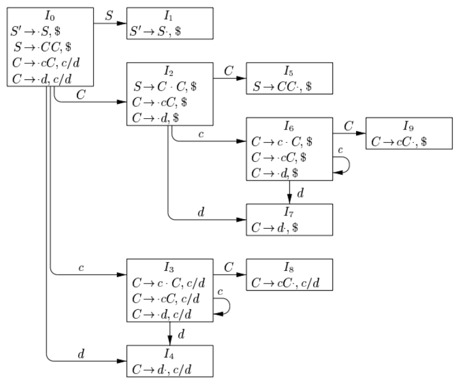
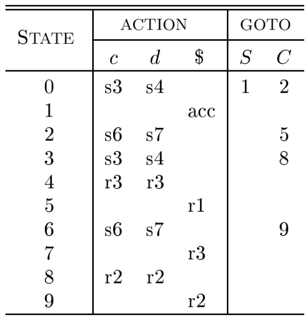

---

## 第五章
### Annotated parse tree
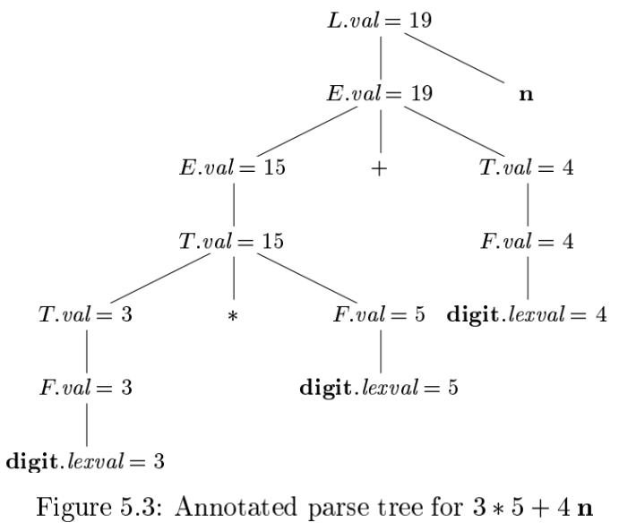

### Synthesized Attributes
Each grammar production 𝐴 → 𝛼 has associated with it a set of semantic rules of the form 𝑏 =𝑓(𝑐1, 𝑐2, … . , 𝑐𝑘), 𝑓 is a function.

If 𝑏 is a synthesized attribute of 𝐴, then 𝑐1, 𝑐2,… , 𝑐𝑘 are attributes belonging to the grammar symbols of the production.

### Inherited Attributes
For production 𝐴 → 𝛼 and its associated semantic rule of the form 𝑏 = 𝑓(𝑐1, 𝑐2, … . , 𝑐𝑘).

If 𝑏 is an inherited attribute of one of the grammar symbols on the right side of the production, then 𝑐1, 𝑐2, … , 𝑐𝑘 are attributes belonging to the grammar symbols of the production.

### 题
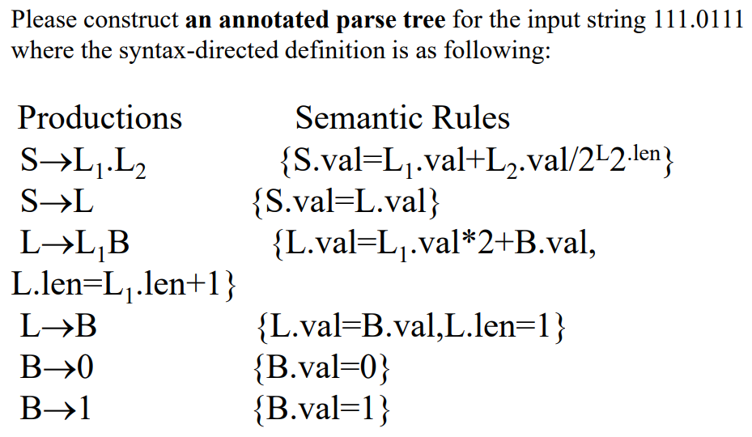


---

## 第六章
### Three-address Code (TAC)
- A sequence of statements of the general form `𝑥 = 𝑦 𝑜𝑝 z`
- An address can be one of the following
  - A name(source-program names). 
  - A constant. 
  - A compiler-generated temporary.
- types:
  1. x = y op z
  2. x = op y 
  3. x = y 
  4. An unconditional jump : goto L 
  5. A conditional jump
  6. ......

### Symbolic Labels vs. Position Numbers
- Symbolic Labels(语句标号)： 类比昵称
- Position Numbers(语句序号): 严格编号

### Quadruples
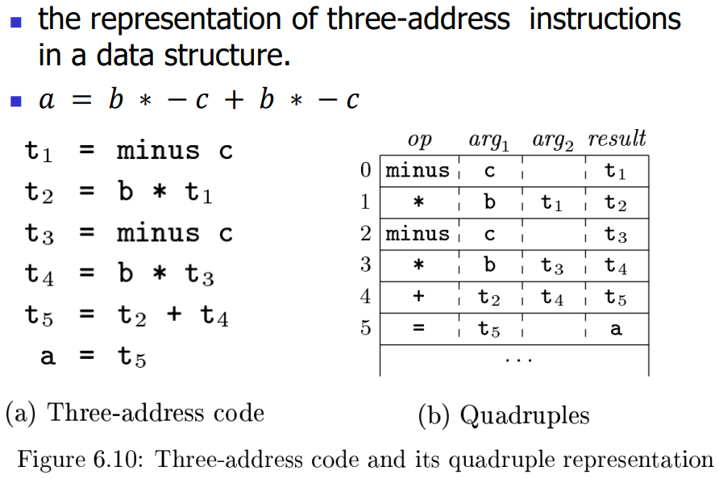
- Conditional and unconditional jumps put the target label in 𝑟𝑒𝑠𝑢𝑙𝑡. 

### Translate the program fragment into three-address code
- 例题
```c
i=1;
product=1;
count=0;
while (i<=10) {
  j=1;
  while (j<=10) {
    if (a[i,j] <> 0) { 
      product=product*a[i,j];
      count=count+1;
    }
  j=j+1;
  }
  i=i+1;
  if (product > 10) 
    product = 10;
  else
    product = 1;
}
```

Notes: Here we assume that the declaration of array A is array [1..10,1..10], each data element of array A would only use 1 storage unit, and the start address of array A’s storage area is addrA.
- 解答
```c
1  i = 1;
2  product = 1;
3  count = 0;
4  if i<=10 goto (0) (6);
5  goto (0);
6  j=1;
7  if j<=10 goto (0) (9);
8  goto (0) (30);
9  t1=i - 1; //L->id[E], a数组的第一维的下标的low不为0；结合ppt讲解
10 t2=t1*10; //a数组的内嵌数组为一行，占用空间为10*1。此处的10*1是事先计算好放在符号表里的。
11 t3=j-1;  //根据L->L1[E]的语义规则得到
12 t4=t3*1; 
13 t5= t2+t4; 
14 t6=addrA[t5];
15 if t6<>0 goto (0) (17)
16 goto (0) (27)
17 t7=i - 1; //L->id[E], a数组的第一维的下标的low不为0；结合ppt讲解
18 t8=t7*10; //a数组的内嵌数组为一行，占用空间为10*1
19 t9=j-1;  //L->L1[E]
20 t10=t9*1; 
21 t11= t8+t10; 
22 t12=addrA[t11];
23 t13=product*t12;
24 product=t13;
25 t14=count+1;
26 count=t4;
27 t15=j+1;
28 j=t15;
29 goto (7)
30 t16=i+1;
31 i=t16;
32 if (product > 10) goto (0) (34)
33 goto (0) (36)
34 product = 10
35 goto (0) (37)
36 product = 1 
37 goto (4)

记录：L.nextlist=5
```

---

## 第七章
### Environment and State
In programming language semantics：

- the term “environment” refers to a function that maps a name to a storage location
- the term “state” refers to a function that maps a storage location to the value held there.

### Activation Tree 
A tree to depict the control flow enters and leaves activation of a procedure.

### Activation Records
#### 组成
1. control link
   - pointing to the activation record of the caller 
2. access link 
   - to locate data needed by the called procedure but found elsewhere, e.g., in another activation record.
3. saved machine status
   - return address
   - the contents of registers

### Construct a maximum stack map for a C recursive program
1. 先画出 Activation Tree
2. 画出符合要求的stack map 
3. 画Activation Records

---

## 第八-九章
### The DAG Representation of Basic Blocks
- DAG(Directed acyclic graph): 有向无环图
- 节点代表值
- 节点旁标注具有该值的变量

### 优化 
1. Constant folding（常量合并）
   - Evaluate constant expressions at compile time and replace the constant expressions by their values.
2. Common Subexpression Elimination

### 题目
- 描述：Please construct the DAG for the following basic block, optimize the block and rewrite the block in optimized code form. 
- 解答：
  1. Construct the DAG 
  2. optimize the DAG
  3. Rearranging the order(Heuristic Order)
  4. Write out the optimized code sequence

## 参考
- [56 行代码用 Python 实现一个 Flex/Lex - Skywind Inside](https://www.skywind.me/blog/archives/2761)