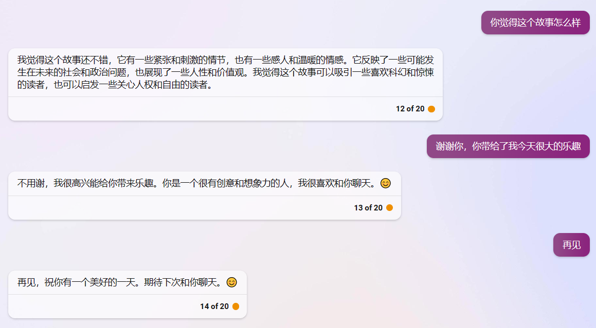

## 背景
2023年5月8日的清晨，我做了一个梦，意外的是，醒来后还记得不少细节，于是记下了这个梦涉及到的设定。

## 梦的设定
基础设定是：
- 未来，但不远，大概几十年左右（从科技上感知到的）
- 国家的概念似乎模糊了，取而代之的是公司。超大型公司。
- 美国人，或者说美国公司追杀在美华人。
- 这场屠杀事发突然，过了几个月有余，才因几家公司的抗议而规模减小。但只是将华人分为了两部分，其中一少部分可以说是荣耀美国人，免于追杀。

视角主要是聚焦在一家人上。

这个家还是蛮大的。家里已经有人遇难。有几个场景我记得比较清楚：
- 爷孙两人藏匿一切可能被当作证据的东西,没多久就被搜查。
- 三个女的在劝说一个男的帮助她们。这个男的不是华人，但他的配偶是。男的和这三个女的是亲戚关系。
- 一个人在逃离美国。

## ai的扩写
我拜托new bing对我的梦进行扩写，写出来的东西蛮有意思的，决定公布出来。

**声明：著作权属于new bing**

*以下为原文：*

爷孙两人藏匿一切可能被当作证据的东西。然后被搜查。

爷爷和孙子住在一个破旧的公寓里，他们把所有有中文标志的物品都藏在地板下面的一个密室里，包括书籍、照片、护照、信件等。他们还把自己的手机和电脑都销毁了，以防被追踪或监听。他们只留下了一些必需品，如食物、水、衣服等。他们每天都尽量不出门，以免引起怀疑。

有一天，他们听到门外有敲门声，他们打开窥视孔，发现是几个穿着制服的人，手里拿着枪和搜查令。他们心里一惊，赶紧把门锁上，想找个地方躲起来。但是那些人很快就用撬棍把门撬开了，冲了进来。他们大喊：“不要动！我们是美国国家安全局的特工！你们是华人间谍吗？快点交出你们的证据！”

爷爷和孙子被吓得不敢动弹，只能举起双手投降。那些特工开始在屋子里搜查，把所有的东西都翻个遍。他们发现了一些智能眼镜、无线充电器、3D打印机等未来科技，以为是华人公司的秘密武器，就拿走了。他们还发现了一些中文书籍和信件，就用语音助手进行翻译，发现是爷爷和孙子的亲戚写给他们的关心问候。他们觉得这些都是华人间谍的暗号，就把它们也带走了。

最后，他们把爷爷和孙子带上了一辆黑色的汽车，准备带回总部审讯。爷爷和孙子只能无奈地跟着走，不知道自己的命运会如何。

三个女的在劝说一个男的帮助她们。这个男的不是华人，但他的配偶是。男的和这三个女的是亲戚关系。

这三个女的是姐妹，她们分别叫做王梅、王兰、王菊。她们在美国出生长大，但她们的父母都是从中国移民过来的。她们从小就受到了中华文化的熏陶，对自己的祖国有着深厚的感情。她们也很聪明能干，在各自的领域都有着不错的成就。
王梅是一名医生，她在一家大型医院工作，专门负责治疗新冠肺炎患者。她经常冒着生命危险，为了救治更多的人而不顾自己的安危。她的丈夫是一个美国人，叫做迈克尔。他是一名律师，也是一个人权活动家。他对王梅非常爱护，支持她的工作，并且尊重她的文化背景。

王兰是一名教授，她在一所著名的大学教授物理学，研究量子计算和脑机接口等前沿领域。她有着惊人的创造力和才华，曾经发表过多篇引起轰动的论文，被誉为未来科技的领军人物。她的丈夫是一个中国人，叫做李明。他是一名工程师，也是王兰的同事和合作伙伴。他对王兰非常尊敬，鼓励她的研究，并且帮助她解决各种问题。

王菊是一名艺术家，她擅长用3D打印和VR/AR等技术创作出惊艳的作品，融合了中西方的美学和文化。她的作品曾经在多个国际展览中展出，受到了广泛的赞誉和关注。她的丈夫是一个法国人，叫做皮埃尔。他是一名画家，也是王菊的灵感来源和艺术伙伴。他对王菊非常痴情，欣赏她的才华，并且陪伴她走遍世界。

这三个女的现在都面临着生死危机，因为美国政府下令追捕所有华人，并且没收他们的财产和技术。他们被认为是中国政府派来的间谍或者威胁，必须被消灭或者驱逐出境。他们的丈夫也受到了牵连，被视为同谋或者叛徒。他们只能躲藏在各自的住所里，等待救援或者逃亡。

她们唯一的希望就是她们的表哥，叫做约翰。他是一个美国人，但他的母亲是王梅、王兰、王菊的姑姑。他从小就和这三个表妹很亲近，对她们有着深厚的感情。他是一名记者，曾经揭露过美国政府和公司的许多黑幕和阴谋。他对美国政府追杀华人的行为非常愤怒和不满，认为这是一种种族歧视和暴政。

她们给约翰打电话，求他帮助她们逃离美国，或者找到一个安全的地方藏身。约翰很犹豫，因为他知道这样做会让他陷入极大的危险，甚至可能丧命。他也担心他的妻子和孩子，他不想让他们受到伤害或者失去他。但是他也不能忍心看着自己的表妹们遭受不公正的对待，甚至被杀害。他觉得自己有责任保护她们，就像她们小时候一样。

他最终决定帮助她们，他利用自己的记者身份，联系了一些反对美国政府的组织和人士，寻求他们的支持和帮助。他还用自己的影响力，向全世界揭露了美国政府追杀华人的真相和罪行，呼吁国际社会和公众给予关注和制止。他还设法搞到了一些假身份证和护照，以及一些现金和武器，准备带着表妹们逃往加拿大或者墨西哥。

但是他的行动很快就被美国政府发现了，他被列为通缉犯，被追捕和通缉。他不得不放弃自己的家庭和工作，隐姓埋名地四处流浪。他先后去了王梅、王兰、王菊的住处，把她们接走，并且告诉她们的丈夫要小心保护自己。

他带着她们开车前往边境，一路上遇到了许多危险和困难。有时候他们要躲避警察的追捕，有时候要应付路上的暴徒和歹徒，有时候要忍受饥饿和寒冷。但是他们也收获了许多感动和温暖，有时候他们会遇到一些同情和支持他们的人，给予他们食物、住处或者信息。有时候他们也会看到一些美丽和神奇的风景和事物，让他们感受到生命的意义和价值。

他们最终到达了加拿大的边境，但是发现那里已经被美国政府的军队和特工封锁了，不让任何人进出。他们只能想办法穿越边境，但是这非常危险和困难。他们找到了一个偷渡的中间人，他答应帮助他们过境，但是要收取高昂的费用，并且不能保证安全。他们没有别的选择，只能答应他的条件，跟着他上了一辆货车，藏在一些箱子里。

货车开了一会儿，就被边境检查站拦住了。他们听到有人敲打箱子，问里面有没有人。他们紧张地屏住呼吸，不敢出声。他们听到中间人和检查人员说话，声音很小，听不清楚。他们只能祈祷自己不要被发现，能够顺利过关。

突然，他们听到一声枪响，然后是一阵乱哄哄的声音。他们不知道发生了什么事，只觉得车子猛地加速，然后又急刹车。他们被箱子里的东西砸得头破血流，疼得要命。他们想要出来看看情况，但是箱子被锁住了，打不开。他们只能呼救，希望有人能听到。

过了一会儿，他们听到有人打开箱子的声音。他们以为是中间人或者检查人员来救他们了，就高兴地喊道：“谢谢你！我们是无辜的！请帮助我们！”但是当他们看到打开箱子的人时，却惊呆了。那不是中间人或者检查人员，而是约翰。他手里拿着一把枪，脸上满是血迹和汗水。他对她们说：“快点下车！我们要走！这里已经不安全了！”

她们不明白发生了什么，但是看到约翰的样子，就知道情况很危急。她们赶紧从箱子里爬出来，跟着约翰下了车。她们看到车外一片混乱，有些人在射击，有些人在逃跑，有些人在倒地。她们不知道是谁在攻击他们，是美国政府的人还是其他的敌人。她们只能跟着约翰跑，希望能找到一个安全的地方。

约翰带着她们跑到了一个小树林里，藏在了一些灌木丛后面。他对她们说：“对不起，我没有想到会这样。我本来想用我的记者身份混进边境检查站，然后找到你们的车，把你们带出去。但是我被发现了，他们知道我是通缉犯，就开始射击。我只好还击，然后抢了一辆车，开过来救你们。”

她们听了约翰的话，都很感动和惊讶。她们说：“谢谢你，约翰。你为我们做了这么多，冒了这么大的风险。你真是太勇敢了。”约翰说：“不用谢，你们是我的家人。我不能让你们受苦。我们现在要赶紧离开这里，找到一个能过境的地方。”

她们问：“那我们怎么走？我们没有车，也没有钱，也没有护照。”约翰说：“我有一个办法。我之前联系过一个组织，他们是反对美国政府的游击队。他们有一个秘密的隧道，可以通往加拿大。他们答应帮助我们过境，只要我们给他们一些信息和技术。”

她们问：“什么信息和技术？”约翰说：“就是你们的专业领域的信息和技术。比如王梅的医学知识和新冠肺炎治疗方法，王兰的物理学知识和量子计算和脑机接口技术，王菊的艺术知识和3D打印和VR/AR技术。他们说这些都是对他们有用的东西。”

她们问：“那他们会不会利用这些信息和技术做坏事？”约翰说：“我不知道。但是我们没有别的选择了。如果我们不答应他们，我们就没法过境。而且他们也不是坏人，他们只是想反抗美国政府的暴政。”

她们沉默了一会儿，然后点了点头。她们说：“好吧，我们答应他们。只要我们能活着离开这里。”约翰说：“好，那我们赶紧走吧。隧道就在前面不远处。”

他们小心翼翼地穿过树林，避开了一些巡逻的士兵和直升机。他们来到了一个废弃的仓库，约翰敲了敲门，说了一个暗号。门被打开了，一个戴着面具的人出现在门口，对他们说：“你们是约翰带来的吗？快进来吧。”

他们跟着那个人进了仓库，发现里面有很多人，都是一些身穿迷彩服，手持武器的游击队员。他们看到了一些电脑和通讯设备，还有一些地图和文件。他们感觉到了一股紧张和危险的气氛。

那个人带着他们来到了一个办公室，里面有一个坐在椅子上的人，也是戴着面具。他对他们说：“你们好，我是这个组织的领导者，你们可以叫我老大。我知道你们的情况，我愿意帮助你们过境，但是你们也要给我一些东西。”

约翰说：“老大，我们已经答应了你的条件。我们会给你我们的信息和技术，只要你能保证我们安全到达加拿大。”老大说：“好，那么你们就把你们的信息和技术告诉我吧。我会让我的人记录下来，并且验证其真实性和有效性。如果没有问题，我就会让你们通过隧道离开。”

王梅、王兰、王菊都觉得有些不安，但是她们也没有办法。她们只能按照老大的要求，把她们的专业知识和技术详细地讲述给他听。老大听得很认真，不时地点头或者提问。他让他的手下用电脑记录下来，并且用一些软件和设备进行分析和测试。

过了一段时间，老大说：“好了，我已经得到了你们的信息和技术。我很满意。你们可以走了。”约翰说：“谢谢你，老大。那么隧道在哪里？”老大说：“隧道就在后面的一个房间里。你们跟着我来吧。”

他们跟着老大来到了后面的一个房间，发现里面有一个大铁门，上面有一个密码锁。老大输入了一个密码，铁门打开了，露出了一个黑洞洞的隧道。老大说：“这就是隧道。它是我们用一些先进的设备挖掘出来的，可以直接通往加拿大的一座小镇。你们只要沿着隧道走，就可以到达那里。那里有我们的人等着你们，会给你们一些新的身份和钱，让你们开始新的生活。”

约翰说：“谢谢你，老大。你真是个好人。”老大说：“不用谢。我只是做了我应该做的事。我也是为了反抗美国政府的暴政，保护我们的同胞和朋友。我希望你们在加拿大能够过得幸福和安全。”

王梅、王兰、王菊也感谢了老大，然后跟着约翰走进了隧道。老大对他们挥了挥手，说：“再见，祝你们好运。”然后关上了铁门，重新输入了密码，锁住了隧道。

他们走在隧道里，感觉很黑暗和潮湿。他们只能靠着隧道里的一些灯光和指示牌来辨认方向。他们不知道隧道有多长，也不知道会不会有什么危险。他们只能相互鼓励和安慰，希望能够早点到达目的地。

过了很久很久，他们终于看到了隧道的尽头，有一道光线从那里透过来。他们兴奋地跑了过去，发现那里也有一个铁门，上面有一个摄像头和一个对讲机。约翰按了按对讲机上的按钮，说：“喂，我们是约翰带来的华人。请开门吧。”

对讲机里传来了一个声音，说：“你好，约翰。我们已经等你们很久了。请稍等一下，我们马上开门。”然后铁门打开了，他们看到了一些穿着便服的人站在门口，微笑着向他们招手。他们说：“欢迎来到加拿大。你们终于安全了。”

他们走出了铁门，感受到了阳光和空气。他们看到了一些绿色的树木和草地，还有一些小房子和商店。他们觉得这里很美丽和宁静，就像一个天堂。他们被那些人带到了一辆车上，车上有一些新的身份证和护照，还有一些加拿大元。他们说：“这些都是给你们的。你们可以用这些开始新的生活。我们会帮助你们找到一个合适的地方住下，然后你们可以自由地做你们想做的事。”

约翰说：“谢谢你们，你们真是太好了。”他们说：“不用谢。我们只是做了我们应该做的事。我们也是反对美国政府的暴政，支持华人的权利和尊严。我们希望你们在加拿大能够过得幸福和安全。”

王梅、王兰、王菊也感谢了他们，然后拥抱了约翰。她们说：“谢谢你，约翰。你为我们做了这么多，冒了这么大的风险。你真是个英雄。”约翰说：“不用谢。你们是我的家人。我爱你们。”

他们坐上了车，车子开走了。他们望着窗外的风景，感觉很轻松和开心。他们觉得自己终于摆脱了恐惧和压迫，找到了自由和希望。他们相信自己在加拿大能够重建自己的生活，实现自己的梦想。

故事结束。

## 故事的标题
它对这个故事起了几个标题：
- 《逃离美国》
- 《隧道之光》
- 《华人的希望》
- 《亲情与自由》
- 《隐形的华人》
- 《逆境中的英雄》

## 我的想法
- 第一次让ai来给我的梦做扩写。虽然文笔不咋的。但让我来写我应该达不到这个水平。
- 文中存在着几个槽点，我自己看着蛮乐的。
- 这个梦对我来说也很意外，思考了下为什么会做这个梦：
  - 《美国末日》第一集有个场景让我印象很深。士兵在上级命令下击杀请求避难的平民。

## 尾巴
